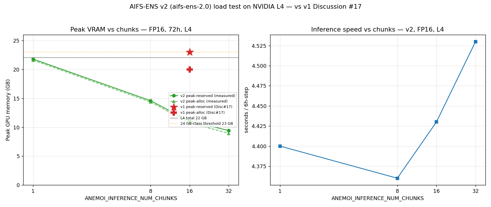
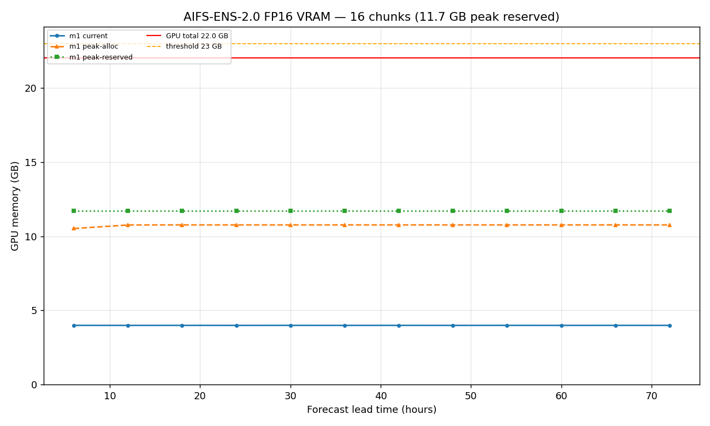

# AIFS-ENS-2.0 FP16 GPU Load Test — Results & Fixes

First end-to-end smoke test of the v2 Step-2 GPU path (the README previously
flagged it as *"written but not yet smoke-tested on a GPU"*). Run on an
**NVIDIA L4 (22 GB usable)** with a real member-1 input pkl built from ECMWF Open
Data (cycle `20260623_0000`, 112 fields).

**Bottom line:** AIFS-ENS-2.0 runs end-to-end in FP16 on a 24 GB-class GPU. At
the default 16 chunks it uses **~10.8 GB allocated / ~11–11.7 GB reserved** for a
72 h forecast — comfortable headroom. GRIB output now works (after the `cos_mwd`
fix below).

## 1. GPU software environment — extra deps beyond the README

The README's pinned list (`anemoi-inference==0.8.3`, `anemoi-models==0.11.2`,
`torch==2.7.0`, `flash-attn==2.7.4.post1`, `earthkit-regrid==0.5.1`, …) is
necessary but **not sufficient**. Three additional requirements were found while
bringing up the env (fresh venv, Python 3.10):

| Missing piece | Symptom | Fix |
|---|---|---|
| `huggingface_hub` | `ImportError: Could not import huggingface_hub` when resolving the `{"huggingface": "ecmwf/aifs-ens-2.0"}` checkpoint | `pip install huggingface_hub` |
| host **C compiler** (`gcc`) | `RuntimeError: Failed to find C compiler` — AIFS-ENS-2.0's GraphTransformer uses a **Triton** JIT kernel (`anemoi.models.triton.gt`) that builds a CUDA shim at runtime (`ptxas` itself ships in the triton wheel) | `apt-get install -y gcc` (and/or `export CC=/usr/bin/gcc`) |
| flash-attn wheel | source build needs `nvcc` (absent) | install the prebuilt wheel `flash_attn-2.7.4.post1+cu12torch2.7cxx11abiTRUE-cp310-...` (torch 2.7 linux wheels are `cxx11_abi=True`) |

## 2. Fixes applied this session

### a. `cos_mwd` / `sin_mwd` GRIB encoding (`ConceptNoMatchError`)
The v2 input prep decomposes mean wave direction `mwd` into circular components
`cos_mwd`/`sin_mwd`; the model emits them back, but they are **not GRIB
parameters**, so `GribFileOutput` died with `ConceptNoMatchError: Concept no
match` on the first write. Recombining into `mwd` does **not** work either:
anemoi's `GribFileOutput.write_step` does `self.typed_variables[name]`, which only
knows checkpoint-declared outputs, so injecting `mwd` raises `KeyError: 'mwd'`
(and `skip_variable` is an allowlist, not a denylist).

**Fix:** `drop_unencodable_wave_dir(state)` drops the two derived components
before GRIB encode (added to both `pytorch_profile_fp16_v2.py` and
`fp16_multi_run_AIFS_ENS_v2.py`, called on each yielded state). Every other field
(118 of 120, including the real wave params `swh`/`mwp`/`cdww`) encodes fine, and
Step 3 only extracts `tp`/`msl`/`2t`. Wave direction can be recovered downstream
as `degrees(atan2(sin_mwd, cos_mwd))` if ever needed. Verified output GRIB:
**1416 messages (118 params × 12 steps)**, `cos_mwd`/`sin_mwd` absent,
`tp`/`msl`/`2t` and `swh`/`mwp`/`cdww` present, ~1.6 GB.

### b. Profiler false "TEST PASSED" on failure
`pytorch_profile_fp16_v2.py` computed `all(not r["exceeded_threshold"] for r in
results)`, which is `True` for an **empty** results list — so a member that
errored before any step (e.g. the GRIB crash) still printed *TEST PASSED*. Now:
the generic `except` records a failure row, and the pass criterion requires at
least one member that both completed (`success`) and stayed under threshold.

### c. PNG generation
`write_memory_plot()` now renders a per-step VRAM timeline PNG
(`aifs_ens_fp16_v2_memory_timeline.png`) from the collected readings, alongside
the existing `*_memory_snapshot.pickle` (for the interactive
[pytorch.org/memory_viz](https://pytorch.org/memory_viz)). The snapshot dump is
also wrapped in try/except (it can raise `RuntimeError: stoi` under
`expandable_segments`).

## 3. Load-test results — v2 chunk sweep (FP16, 72 h, L4 22 GB)

`ANEMOI_INFERENCE_NUM_CHUNKS` is the dominant VRAM lever:

| chunks | peak alloc | peak reserved | s/step | result |
|-------:|-----------:|--------------:|-------:|:------:|
| 1  | 21.60 GB | 21.79 GB | ~4.4 | **OOM** (at step 4 on 22 GB) |
| 8  | 14.37 GB | 14.60 GB | 4.36 | PASS |
| 16 | 10.76 GB | 11.05 GB | 4.43 | PASS |
| 32 |  8.95 GB |  9.43 GB | 4.53 | PASS |

(The full GRIB-writing profiler at 16 chunks measured 10.77 GB alloc / 11.73 GB
reserved — slightly higher reserved due to GRIB buffers — 78.9 s for 72 h.)

Memory is flat across the 12 steps (no leak); speed is nearly chunk-independent
(~4.4 s/step), so higher chunking buys VRAM headroom almost for free.

## 4. v1 vs v2 — contrast with aifs-ens-1.0 Discussion #17

Reference: [aifs-ens-1.0 Discussion #17](https://huggingface.co/ecmwf/aifs-ens-1.0/discussions/17)
reports v1 at **FP16 + 16 chunks ≈ 20 GB allocated / 23 GB reserved** on a 24 GB GPU.

- **v1 could not be re-run on this env.** The aifs-ens-1.0 checkpoint is a
  fully-pickled `nn.Module` tied to the v1-era `torch_geometric`
  (`torch_geometric.nn.conv.utils.inspector` was removed in tg 2.6.x; the
  `Inspector` API also changed — `'Inspector' object has no attribute '_cls'`).
  Running v1 would need a separate v1-era software env. So v1 is represented by
  the published Discussion #17 figures.
- **v2 @16 chunks (~11 GB reserved) is ~12 GB lighter than the Disc#17 v1
  figure** — but **v2 @1 chunk (~21.8 GB, OOM)** lands right in the Disc#17
  ballpark. This strongly suggests the headline difference is driven by
  *chunking*, not the model size per se: at equal (low) chunking the two are
  comparable; v2's default 16-chunk config simply profiles much lighter.




## 5. Repro scripts (added this session)

| Script | Role |
|---|---|
| `loadtest_mem_v2.py` | Minimal load test: drives `runner.run()` and logs per-step VRAM, output sunk (isolates compute/memory from GRIB) |
| `build_v1_pkl.py` | Builds a v1 (92-field) input pkl from Open Data for the v1 comparison |
| `compare_v1_v2_loadtest.py` | Reads the chunk-sweep CSV → comparison PNG + table vs Disc#17 |

```bash
# v2 load test + PNG + GRIB (24 GB-class GPU, v2 env, gcc + CC set)
export HF_HOME=/scratch/hf_cache CC=/usr/bin/gcc
python pytorch_profile_fp16_v2.py --chunks 16 --members 1 --lead-time 72 \
    --pickle-dir /scratch/input_states --output-dir /scratch/profile_v2

# quick chunk sweep (no GRIB)
for C in 8 16 32; do python loadtest_mem_v2.py --chunks $C --lead-time 72; done
```
